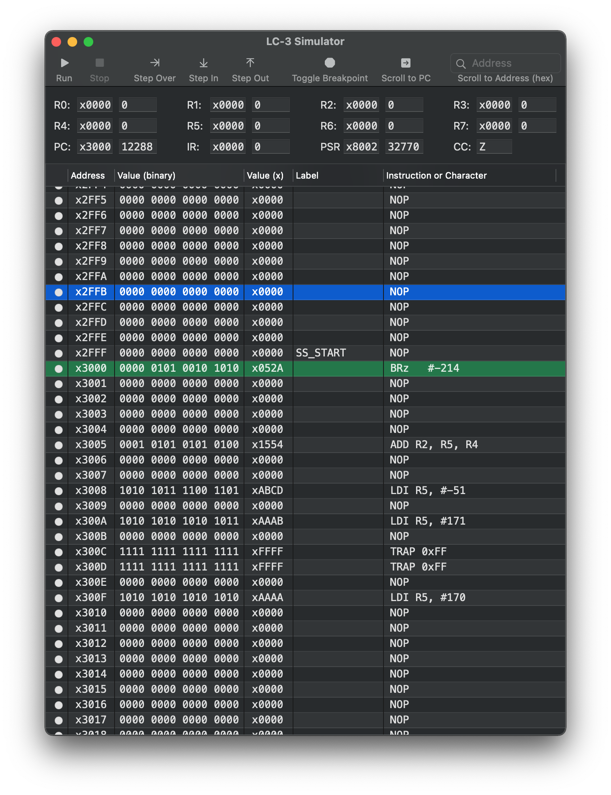
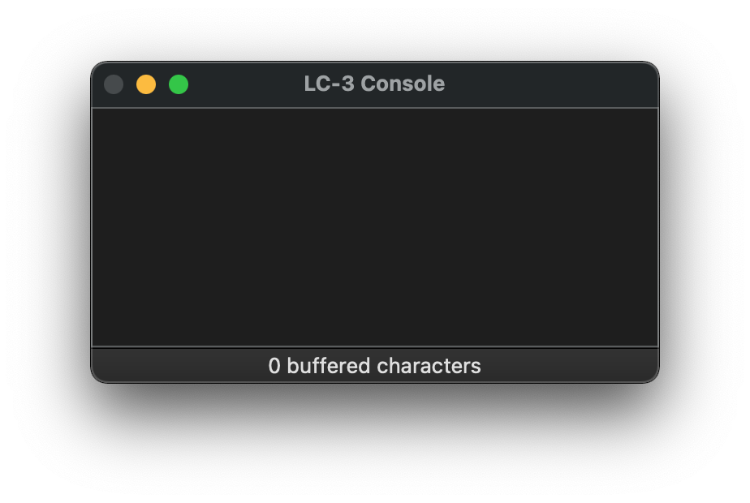

#  macOS LC-3 Simulator

This is a native Swift and Cocoa-based implementation of an LC-3 simulator for macOS 11.

## Structure

The simulator UI is laid out in two windows. 

The main window contains a toolbar, text fields representing registers, and a table view representing memory.



The console window displays the simulator console.



## How to use

### Assembling programs before loading

Programs should be assembled using the `lc3as` assembler provided with `lc3tools`. `lc3tools` are available from http://highered.mheducation.com/sites/0072467509/student_view0/lc-3_simulator.html under the `LC-3 Unix Simulator (56.0K)` link. These tools can be built using

``` bash
wget <download link>.zip
unzip <download link>.zip
cd <download link>
./configure
make
```

This produces the `lc3as` binary in the unzipped `<download link>` directory.

Run the `lc3as` program on assembly files to produce `.obj` and `.sym` files, which will be loaded into the simulator.

### Loading programs and symbol files

Users can load programs with File->Open. Users can select any number of `.obj` files.

After loading an `.obj` file, the simulator will attempt to also open a `.sym` file of the same name. This will load labels for memory locations.

### Running programs

The toolbar buttons and menu items under the `Simulate` menu to control simulator execution. This includes:
* `Run` - Execute until the simulator halts
* `Stop` - Stop execution immediately
* `Step In` - Execute one instruction, then stop
* `Step Over` - Execute one instruction, continuing execution for any subroutines that instruction calls
* `Step Out` - Execute until stepping out of a subroutine

### Setting breakpoints

Toggle breakpoints by clicking the breakpoint icon on a row in the memory view using the `Toggle Breakpoint` menu item or button.

Breakpoints can be set at any time, including while the simulator is running. 

The simulator always stops execution when it hits a breakpoint.

### Changing register and memory values

The values of registers and memory locations can be changed only while the simulator is not running.

To change a register value, edit the hex or decimal text field of the register you want to change.

To change a memory value, double-click the binary or hex representation of the value you want to change, give a new value, and hit the `return` key or click outside the active text field.

### Changing the PC

Use the `Simulate->Set PC to Seleted Row` menu item.

### Changing a label

Double-click the label section of a memory table view row, giving a new label value, and hit the `return` key or click outside of the active text field.

### Jumping to address

The search field can be used to search for and jump to addresses. Addresses are given in hex notation.

### Resetting the simulator

Use the `Simulate->Reset Simulator` menu item.

This resets the memory, registers, and console.

### Jumping to the PC

Use the `Simulate->Scroll to PC` menu item.

### Known issues

* The simulator is slow to update the console. I think I'll have to use something other than an NSTextView to host the text, or change the way I'm performing updates to it. As is, appending to it for every character the simulator wants to output, the whole UI can become unresponsive while it's trying to render new text. Several naive approaches haven't helped much with this.

## Motivation

While at Cal Poly SLO, I took the class CSC 225, which is taught using the LC-3.

While taking the class, I was frustrated by the lack of a graphical simulator on macOS. There was a web version (https://wchargin.github.io/lc3web/), but it didn't allow continuous scrolling and wasn't very fast. I wanted something like the Windows simulator (http://highered.mheducation.com/sites/0072467509/student_view0/lc-3_simulator.html), but better-looking and native to macOS.
